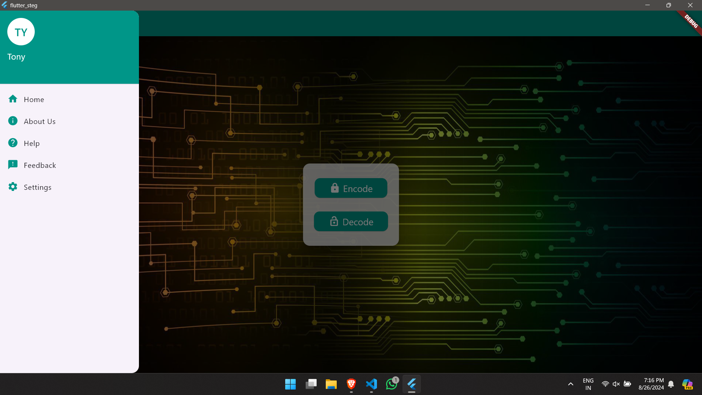

🌟 Flutter Steg App

A Windows desktop Flutter application that implements steganography — the art of hiding messages inside images.
This project is designed for educational purposes, showcasing how encoding and decoding can be done through a user-friendly interface.

✨ Features

* 🗂 Navigation Drawer with:
    *Home
    *About Us
    *Help
    *Feedback
    *Settings
*🌙 Light/Dark Mode Toggle
*💾 Persistent Storage using SharedPreferences
*🔐 Login / Logout Flow
*🖼 Encode Text into Images
*📤 Decode Text from Images
*🖥 Built for Windows Desktop (can be adapted for mobile)

📸 Screenshots

### App Logo

---

### Authentication
| Login Page |
|------------|
|  |

---

### Home & Navigation
| Home Page | Drawer |
|-----------|--------|
|  |  |

---

### Encoding Process
| Step 1 | Step 2 |
|--------|--------|
|  |  |

| Step 3 | Step 4 |
|--------|--------|
|  |  |

| Step 5 |
|--------|
|  |

---

### Decoding Process
| Step 1 | Step 2 |
|--------|--------|
|  |  |

| Step 3 |
|--------|
|  |

---

### Additional Pages
| Feedback Page | About Us Page | Settings Page |
|---------------|--------------|---------------|
|  |  |  |

---

### Dark Mode

* 🧠 How It Works (Steganography Logic)

This app uses Least Significant Bit (LSB) steganography for hiding and extracting data from images.

Encoding Process
1) User selects an image.
2) The secret message is converted to binary.
3) Each bit of the message is stored in the least significant bit of the image pixels.
4) The modified image is saved — visually identical to the original.

Decoding Process
1) User selects a stego-image.
2) The least significant bits from the pixels are read.
3) The bits are grouped to reconstruct the original binary message.
4) The binary is converted back into text and displayed.

This process is lossless for the message and does not visibly alter the image.

🛠 Tech Stack

* Framework: Flutter
* Language: Dart
* Image Processing: image package
* Storage: SharedPreferences
* Target Platform: Windows Desktop
* IDE: VS Code + Visual Studio 2022

🚀 Getting Started

📦 Prerequisites
* Flutter SDK
* Dart SDK
* Visual Studio 2022 with "Desktop development with C++" workload
* Git

⚙️ Installation
# Clone the repository
git clone https://github.com/use your name/flutter_steg.git

# Navigate into the project folder
cd flutter_steg

# Get dependencies
flutter pub get

# Build for Windows
flutter build windows

# Run the app
flutter run -d windows

📂 Project Structure
lib/
 ├── main.dart           # Entry point
 ├── app_drawer.dart     # Navigation drawer
 ├── home_page.dart      # Home screen
 ├── settings_page.dart  # Settings with theme toggle
 ├── encode_page.dart    # Encoding logic UI
 ├── decode_page.dart    # Decoding logic UI
 ├── about_us.dart       # About Us screen
 ├── help_page.dart      # Help screen
 ├── feedback_page.dart  # Feedback form screen

* 🖼 Support for more image formats
* 📱 Mobile version (Android/iOS)
* 🗜 Compression for embedded data
* 🔐 Password-protected messages